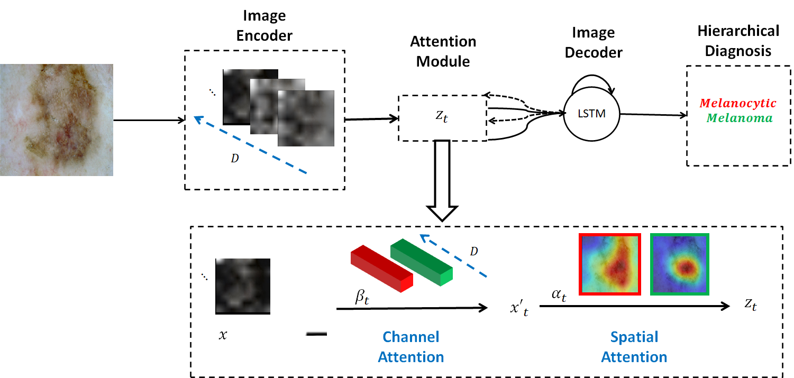

# Hierarchical Diagnosis of Skin Lesions
A Tensorflow implementation of the **Deep Attention Hierarchical Model** for the diagnosis of skin lesions.



Block diagram of the proposed system. The colors identify the channel and spatial attention weights ($\beta_{t}$ and $\alpha_{t}$) associated with each of the sequential diagnosis.

https://www.sciencedirect.com/science/article/abs/pii/S0031320320302168

https://openaccess.thecvf.com/content_CVPRW_2019/html/ISIC/Barata_Deep_Attention_Model_for_the_Hierarchical_Diagnosis_of_Skin_Lesions_CVPRW_2019_paper.html

## Requirements
Tensorflow version >= 1.13

Python 3.6

## Usage
1) Download ImageNet pre-trained checkpoints from **https://tinyurl.com/y7s4tald** and add to the **checkpoints** folder

2) Download the dataset tf recorders from and add to the **data** folder or create your own hierarchical tf records

3) To be added soon


## Reference

```
@article{barata2020explainable,
  title={Explainable Skin Lesion Diagnosis Using Taxonomies},
  author={Barata, Catarina and Celebi, M Emre and Marques, Jorge S},
  journal={Pattern Recognition},
  pages={107413},
  year={2020},
  publisher={Elsevier}
}

@inproceedings{barata2019deep,
  title={Deep attention model for the hierarchical diagnosis of skin lesions},
  author={Barata, Catarina and Marques, Jorge S and Emre Celebi, M},
  booktitle={Proceedings of the IEEE Conference on Computer Vision and Pattern Recognition Workshops},
  pages={0--0},
  year={2019}
}

```
